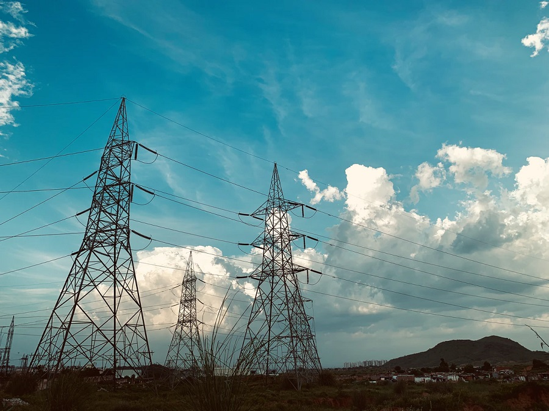

# Введение в прогнозирование временных рядов

Что такое прогнозирование временных рядов? Речь идет о предсказании будущих событий, анализируя тенденции прошлого.

## Региональная тема: потребление электроэнергии во всем мире ✨

В этих двух уроках вы познакомитесь с прогнозированием временных серий, несколько менее известной областью машинного обучения, которая, тем не менее, чрезвычайно ценна для промышленности и бизнес-приложений, среди других областей. Хотя нейронные сети можно использовать для повышения полезности этих моделей, мы будем изучать их в контексте классического машинного обучения, поскольку модели помогают прогнозировать будущую производительность на основе прошлого.

Наш региональный фокус - использование электроэнергии в мире, интересный набор данных, позволяющий узнать о прогнозировании будущего использования энергии на основе моделей прошлой нагрузки. Вы можете увидеть, что такое прогнозирование может быть чрезвычайно полезным в бизнес-среде.

Автор фотографии <a href="https://unsplash.com/@shutter_log?utm_source=unsplash&utm_medium=referral&utm_content=creditCopyText">Педди Саи Хритика</a> электрических башен на дороге в Раджастане на <a href="https://unsplash.com/s/photos/electric-india?utm_source=unsplash&utm_medium=referral&utm_content=creditCopyText">Unsplash</a>

## Уроки

1. [Введение в прогнозирование временных рядов](../1-Introduction/README.md)
2. [Построение моделей ARIMA](../2-ARIMA/README.md)

## Благодарности

«Введение в прогнозирование временных рядов» было написано с ⚡️ [Франческа Лазерри](https://twitter.com/frlazzeri) и [Джен Лупер](https://twitter.com/jenlooper)
